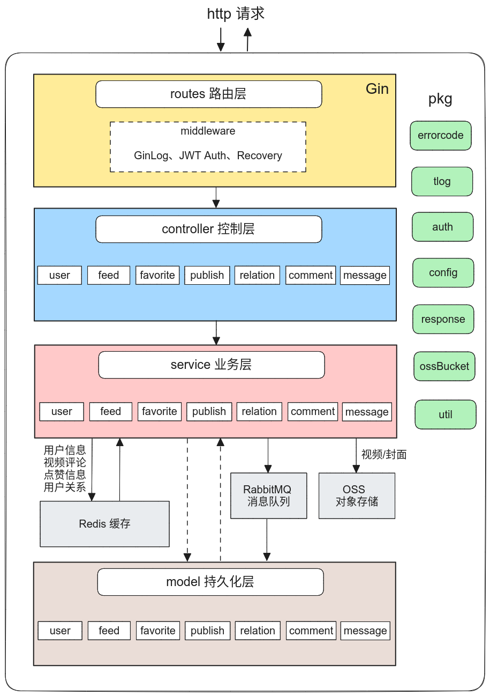
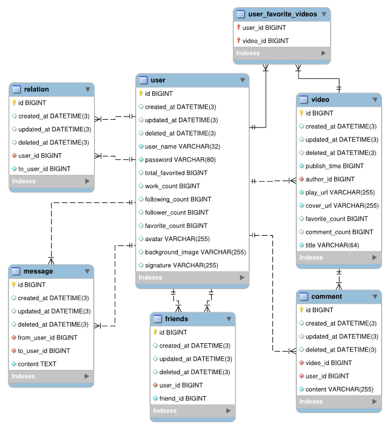

<div align="center">

  <h1 align="center">TikTok-Server</h1>
  <span>极简抖音后端服务 —— tiny tiktok server</span></br>
  <span>字节跳动青训营-后端结营项目</span></br></br>

  <span></span> <span></span> <span></span> <span></span>

</div>

## 介绍
本仓库是我的字节跳动青训营第三届结营项目个人实现仓库（以个人的思路与设计风格实现，做到代码简洁规范）。  
原小队合作仓库：[八位帝皇丸小队仓库](https://github.com/jhzol/TikTokLite)   

若有问题或建议欢迎 issue 讨论，十分感谢 :smiley_cat:  

> **_API文档:_**  
> [极简抖音APIfox](https://apifox.com/apidoc/shared-09d88f32-0b6c-4157-9d07-a36d32d7a75c/api-50707523)  
> [app 客户端文档](https://bytedance.feishu.cn/docs/doccnM9KkBAdyDhg8qaeGlIz7S7#quPkfu)

### 任务列表  
**已完成：**
- [x] 代码规范，commit 清晰
- [x] 项目分层架构设计
- [x] 关系数据库设计，字段类型正确，存储大小设计合理，索引正确
- [x] 鉴权、日志、recovery 的 Gin 中间件
- [x] 错误码、配置文件、日志封装
- [x] 视频文件上传 oss 对象存储
- [x] MySQL 多表更新使用事务实现
- [x] 完成各 api 接口业务逻辑
- [x] postman 各接口测试 
- [x] 实现 redis 缓存服务 
- [x] 修改读业务先查缓存，再查数据库
- [x] 增加 rabbitMQ 消息队列服务

**正在做：**
- [ ] 整体项目 docker 部署
- [ ] golangci-lint 代码检查

**待定：**
- [ ] 完善单元测试
- [ ] 使用 pprof 性能测试
- [ ] 重构为微服务架构
---------

## 如何运行
请安装 docker 与 docker-compose，然后在项目 `docker` 目录下执行
```bash
docker-compose up -d
```

## Clean MVC 架构
### 项目布局
```bash
.
├── cmd
│   └── tiktok-server           # 项目启动入口
├── .config                     # 服务相关 yaml 配置文件
├── routes                      # 路由层
├── controller                  # 控制层
├── service                     # 服务层
├── cache                       # redis 缓存层
├── rabbitmq                    # 消息队列
├── model                       # 持久化层
├── middleware                  # gin 中间件
├── pkg                         # 公共包
│   ├── auth                    # JWT 鉴权
│   ├── config                  # 封装 viper 配置包
│   ├── errorcode               # 错误码
│   ├── ossBucket               # 阿里云 oss 对象存储
│   ├── response                # 统一响应包装
│   ├── tlog                    # 日志
│   └── util                    # 工具包
├── docker                      # docker-compose 配置
│   ├── mysql
│   ├── redis
│   │   ├── data                # redis 持久化数据（aof 与 快照）
│   │   │   └── appendonlydir
│   │   └── log
│   ├── rabbitmq
│   └── docker-compose.yml      # docker-compose 启动配置
└── idl                         # protobuf idl 文件与生成的 go 文件
    ├── gen
    └── proto
```
### 服务架构图示


### MySQL 实体关系


## redis 缓存配置
配置文件见 `docker/redis` 目录中的 `redis.conf` 文件。
- 最大内存限制 100mb （电脑内存小，docker 启动 redis 内存占用太高）
- 开启超出内存调度策略 LFU
- 启动主动整理内存碎片
- 使用混合持久化（AOF + RDB）

### 缓存与数据库一致性方案
读写分离，读操作先去缓存查未命中在查 DB。  
写操作先更新数据库，再删除缓存。其中删除缓存操作使用消息队列重试缓存删除。

### 缓存 KV 设计
#### 用户信息  
直接将需要返回的用户信息结构体序列化后使用 string 结构存储。  
|  KEY   | VALUE  |
|  ----  | ----  |
| user:ID  | string |

#### 关注关系
使用 set 存储当前用户关注的所有用户 ID。  
|  KEY   | VALUE  |
|  ----  | ----  |
| user:ID  | id |

#### 点赞关系
使用 set 存储，某用户的全部点赞视频    
|  KEY   | VALUE  |
|  ----  | ----  |
| user:ID  | videoID |

使用 set 存储，某视频的全部点赞用户    
|  KEY   | VALUE  |
|  ----  | ----  |
| video:ID  | userID |

### 仅做部分缓
> **_NOTE:_**    
> 时间有限，只做了部分缓存(userInfo; relation; favorite; comment)，后续有时间再完善  
> 还想加一个定时任务，定期将点赞信息持久化到 DB

## RabbitMQ 消息队列  
kafka 有些麻烦，换用 rabbitMQ 作为消息队列。
- 交换机使用 direct 类型
- 简单的生产者消费者模式

## 日志方案
- zap
- lumberjack  
分级日志（Debug，Info，warn，error，Fatal）。    
终端日志与文件日志分离，终端日志使用彩色输出。  
日志文件按大小自动分割保存。

## 路由中间件
- gin
### JWT 鉴权中间件
> 源 jwt-go 仓库改动不再维护，使用如下新仓库
> https://github.com/golang-jwt/jwt
### 日志中间件
使用自己封装的 zap 日志库，记录请求日志。
### recovery 中间件
自动恢复服务 panic。

## 错误代码封装
> 使用该仓库的错误代码方案
> https://github.com/marmotedu/sample-code
对开发者展示的错误与用户展示的错误分开处理，对不同类型错误返回不同的错误码。


## 微服务
// TODO: 之后有时间做(框架待定：kratos)

## 鸣谢
八位帝皇丸小队成员  
[字节跳动青训营](https://youthcamp.bytedance.com/)